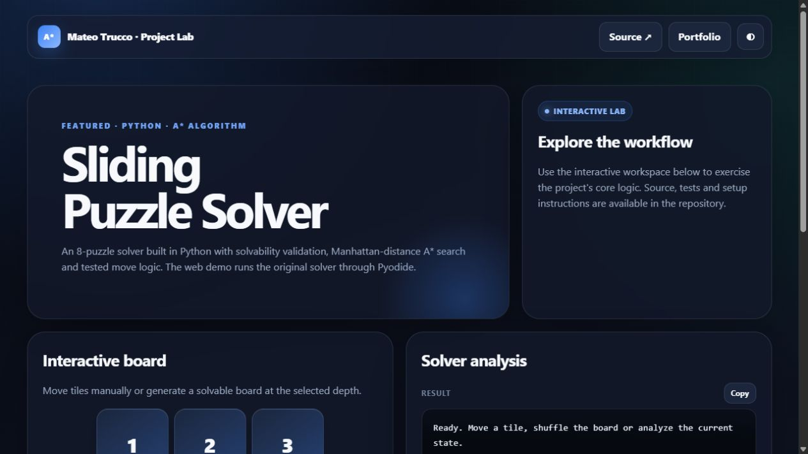

# Sliding Puzzle Solver

An interactive 8-puzzle desktop app that uses **A\*** with Manhattan distance to find an optimal solution.

## Highlights

- Valid playable boards generated by legal moves
- Explicit invalid, solved, and unsolvable states
- Shortest-path A\* solver
- Non-blocking background solving
- Step-by-step and automatic animation
- Unit tests, including a known 31-move puzzle

## Run

```bash
python main.py
```

## Test

From this folder:

```bash
python -m pytest tests
```

---

## Interactive preview

[](https://mateotrucco.github.io/sliding_puzzle_solver/)

**[Open the live experience](https://mateotrucco.github.io/sliding_puzzle_solver/)** · [View the portfolio](https://mateotrucco.github.io/)

## Engineering baseline

- Business logic separated from presentation
- Automated tests and GitHub Actions CI
- Responsive, keyboard-friendly browser experience
- MIT licensed and documented setup

